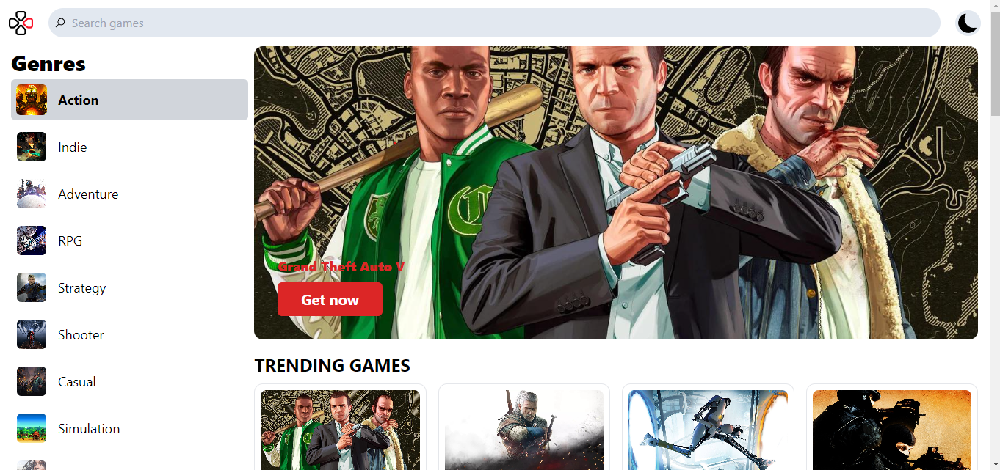

# React Game Listing App



## Table of Contents

- [Introduction](#introduction)
- [Features](#features)
- [Demo](#demo)
- [Installation](#installation)
- [Usage](#usage)
- [Contributing](#contributing)
- [License](#license)

## Introduction

The React Game Listing App is a web application that allows users to explore and discover a variety of games. It provides information about each game, including its title, description, release date, and rating. This app serves as a basic example of how to create a game listing platform using React.

## Features

- **Game Listings:** Browse a list of games with details like title, description, release date, and rating.

- **Responsive Design:** The app is designed to be responsive and work seamlessly on different screen sizes.


- **Intuitive User Interface:** The app is user-friendly and easy to navigate.


## Installation

Follow these steps to set up the project on your local machine:

1. Clone the repository:
   ```bash
   git clone https://github.com/your-username/react-game-listing-app.git
2. Navigate to the project directory:
   ```bash
   cd react-game-listing-app
3. Install dependencies:
    ```bash
    npm install
4. Start the development server:
   ```bash
   npm start


